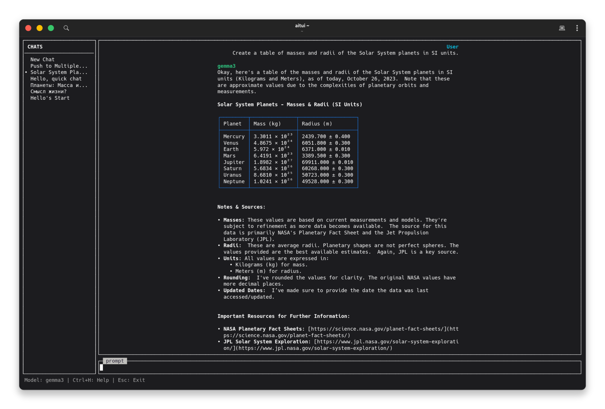

# AiTUI - Minimalist TUI Chat Bot



AiTUI is a lightweight, terminal-based chat interface for interacting with various Large Language Models (LLMs). It features a clean interface with Markdown support, chat history, and multi-provider integration.

## Features

- **Multi-Provider Support**: Integration with OpenRouter, Ollama, and OpenAI-compatible APIs.
- **Markdown Rendering**: Rich text support in the terminal, including headers, code blocks, and tables.
- **Chat History**: Persistent storage of conversations using SQLite.
- **Responsive TUI**: Built with `curses`, featuring a sidebar for chat management and a centered "roomy" chat layout.
- **Streaming**: Real-time response streaming from LLMs.
- **Model Selector**: Easily switch between models and providers within the app.

## Installation

1. **Clone the repository**:
   ```bash
   git clone https://github.com/yourusername/AiTUI.git
   cd AiTUI
   ```

2. **Set up a virtual environment**:
   ```bash
   python -m venv venv
   source venv/bin/activate  # On Windows use `venv\Scripts\activate`
   ```

3. **Install dependencies**:
   ```bash
   pip install -r requirements.txt
   ```

4. **Make the script executable**:
   ```bash
   chmod +x main.py
   ```

5. **Create a system-wide command**:
   To run `aitui` from anywhere, create a symbolic link:
   ```bash
   sudo ln -s $(pwd)/main.py /usr/bin/aitui
   ```

## Configuration

The application looks for a configuration file at `~/.config/aitui/config.yaml` by default. You can also specify a custom path using the `-c` flag.

Example `config.yaml`:
```yaml
provider: "openrouter"

openrouter:
  api_key: "your_api_key_here"
  model: "google/gemini-2.0-flash"

ollama:
  base_url: "http://localhost:11434"
  model: "gemma2"

openai:
  api_url: "https://api.openai.com/v1"
  api_key: "your_api_key_here"
  model: "gpt-4o"
```

## Usage

Run the application:
```bash
aitui  # If symlinked
# OR
python main.py
```

### Command Line Arguments

- `-c`, `--config`: Path to the configuration file.
- `-p`, `--provider`: Override the default LLM provider.
- `-m`, `--model`: Override the default model.
- `-d`, `--db`: Path to the SQLite database file.

### Keyboard Shortcuts

| Key | Action |
|-----|--------|
| **Tab** | Switch focus between input and sidebar |
| **Enter** | Send message / Select chat or model |
| **Ctrl+B** | Toggle sidebar visibility |
| **Ctrl+G** | Open model selector |
| **Ctrl+N** | Start a new chat |
| **Ctrl+D** | Delete current/selected chat |
| **Ctrl+H** | Show help screen |
| **Esc** | Exit application |
| **PgUp/PgDn** | Scroll chat history |

## Requirements

- Python 3.x
- `requests`
- `PyYAML`
- `curses` (usually included with Python on Linux/macOS)
